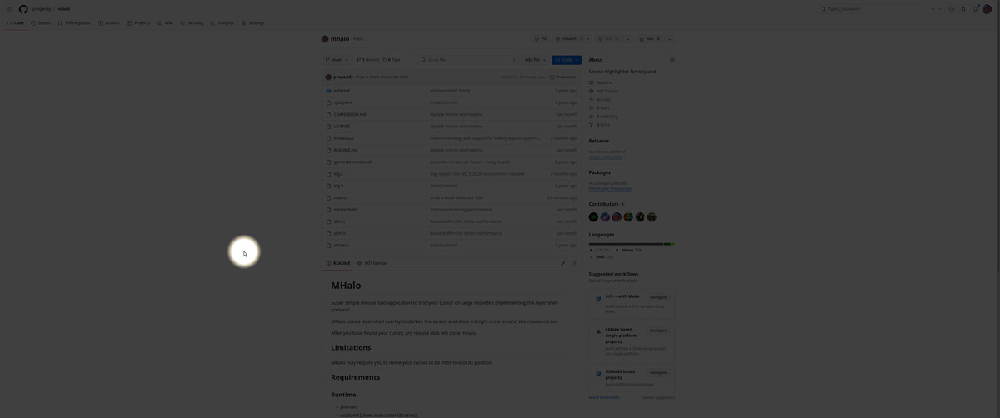

# MHalo

Super simple mouse halo application to find your cursor on large monitors
implementing the layer-shell protocol.

MHalo uses a layer-shell overlay to darken the screen 
and show a bright circle around the mouse cursor.

After you have found your cursor, any mouse click will close mhalo.



## Limitations

MHalo may require you to move your cursor to be informed of its position.

## Requirements

### Runtime

* pixman
* wayland (_client_ and _cursor_ libraries)

### Compile time

* Development packages for all the libraries listed under _runtime_.
* wayland-protocols
* [tllist](https://codeberg.org/dnkl/tllist)


## Building

```sh
meson --buildtype=release build
ninja -C build
sudo ninja -C build install
```

## Reused Works

* [wbg](https://codeberg.org/dnkl/wbg): Thanks to dnkl for the development 
  of the wallpaper application wbg. It's code was a very solid foundation
  for me to build this tool.

## License
MHalo is released under the [MIT license](LICENSE).

